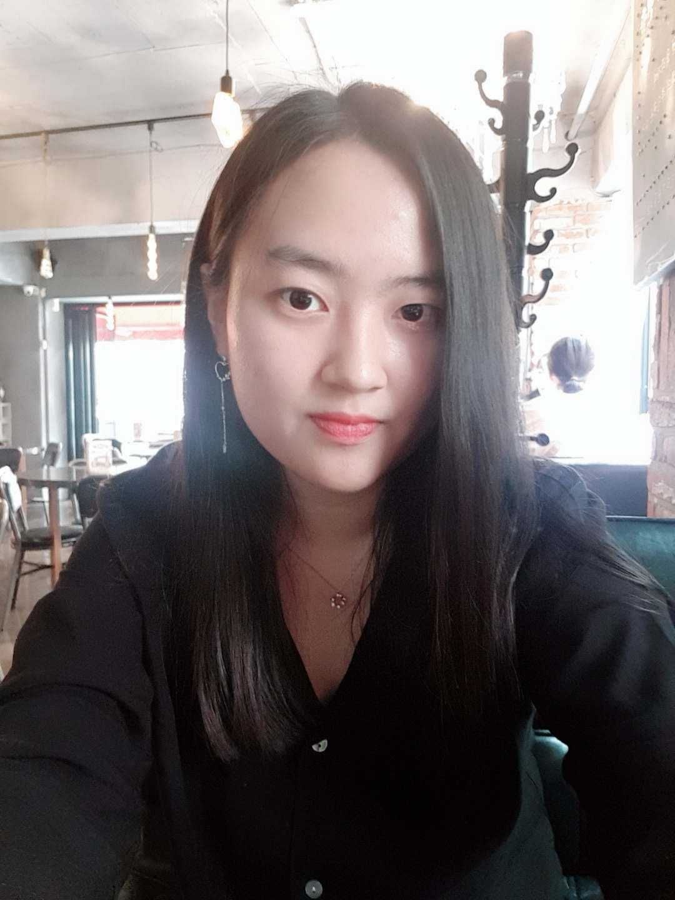
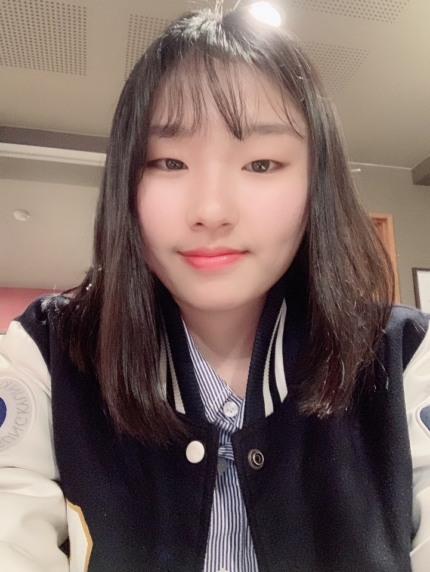

<!-- Main -->

<section id="one" class="spotlights">
	<section>
		

			
			

				<header class="major">
					<h3>김윤호</h3>
				</header>
				
<h4>소프트웨어학과 GitHub ID : rladbsgh7586</h4><li>python 알고리즘 구현</li><li>Issue관리</li>

				<ul class="actions">
					<li><a href="https://github.com/rladbsgh7586" target="_blank" class="button">github</a></li>
				</ul>
			

		

		

			
			

				<header class="major">
					<h3>설채은</h3>
				</header>
				
<h4>소프트웨어학과 GitHub ID : SeolChaeEun</h4><li>GitHub 정적페이지 담당</li><li>정적 페이지 Commit, Project, 팀원 정보 업로드</li>

				<ul class="actions">
					<li><a href="https://github.com/rladbsgh7586" target="_blank" class="button">github</a></li>
				</ul>
			

		

		

			
			

				<header class="major">
					<h3>성주용</h3>
				</header>
				
<h4>인공지능융합전공 GitHub ID : tmznwnel</h4><li>python 알고리즘 구현</li><li>알고리즘 코드 리뷰 및 수정</li>

				<ul class="actions">
					<li><a href="https://github.com/tmznwnel" target="_blank" class="button">github</a></li>
				</ul>
			

		

	</section>
	<section>
		

			
			

				<header class="major">
					<h3>윤소희</h3>
				</header>
				
<h4>소프트웨어학과 GitHub ID : skkusohee</h4><li>C언어, C++, java 알고리즘 구현</li><li>알고리즘 코드 리뷰 및 수정</li>

				<ul class="actions">
					<li><a href="https://github.com/skkusohee" target="_blank" class="button">github</a></li>
				</ul>
			

		

		

			
			

				<header class="major">
					<h3>이산하</h3>
				</header>
				
<h4>소프트웨어학과 GitHub ID : Ehqht</h4><li>C언어, C++ 알고리즘 구현</li><li>이미 구현된 알고리즘 코드 리뷰 및 수정</li>

				<ul class="actions">
					<li><a href="https://github.com/Ehqht" target="_blank" class="button">github</a></li>
				</ul>
			

		

	</section>
</section>

